# Offer calculation algorithms - CFR, CFR_CP, FFR_AI

- **Diagram Type**: Custom
- **Package**: HomerSelect/BSL/Modules/Product Calculator/Analytical Model/Product Calculator Engine/Business Rules/Traditional Product without Financing Scheme/Calculation type algorithms
- **Diagram ID**: 164311
- **Elements**: 14
- **Connectors**: 20

```mermaid
graph TD
    Financial_calculations_Annuity_calculations["Financial calculations : Annuity calculations"]
    Annuity_calculation["Annuity calculation"]
    EIR_calculation["EIR calculation"]
    Calculate_product_offer_Calculate_product_offer["Calculate product offer : Calculate product offer"]
    Cash_Payment_on_Product["Cash Payment on Product"]
    DEL_Calculated_flat_rate_and_cash_payment_CFR_CP["{DEL}Calculated flat rate and cash payment (CFR_CP)"]
    DEL_Calculated_flat_rate_CFR["{DEL}Calculated flat rate (CFR)"]
    Annuity_factor_30_360_definition["Annuity factor 30/360 definition"]
    Cash_payment_definition["Cash payment definition"]
    Total_Monthly_Payment_definition["Total Monthly Payment definition"]
    Origination_fees_amount_definition["Origination fees amount definition"]
    MOD_Annuity_base_amount_definition["{MOD}Annuity base amount definition"]
    Financial_calculation_Financial_calculations["Financial calculation : Financial calculations"]
    DEL_Fixed_flat_rate_and_fixed_number_of_advance_payments_FFR["{DEL}Fixed flat rate and fixed number of advance payments (FFR_AI)"]
    DEL_Calculated_flat_rate_CFR -->|unnamed| Cash_payment_definition
    DEL_Calculated_flat_rate_and_cash_payment_CFR_CP -->|unnamed| Total_Monthly_Payment_definition
    DEL_Calculated_flat_rate_and_cash_payment_CFR_CP -->|unnamed| Annuity_calculation
    DEL_Calculated_flat_rate_and_cash_payment_CFR_CP -->|unnamed| Annuity_factor_30_360_definition
    DEL_Calculated_flat_rate_and_cash_payment_CFR_CP -->|unnamed| Cash_Payment_on_Product
    DEL_Calculated_flat_rate_CFR -->|unnamed| Cash_Payment_on_Product
    DEL_Calculated_flat_rate_CFR -->|unnamed| Annuity_factor_30_360_definition
    DEL_Calculated_flat_rate_CFR -->|unnamed| Annuity_calculation
    DEL_Calculated_flat_rate_CFR -->|unnamed| MOD_Annuity_base_amount_definition
    Annuity_calculation -->|unnamed| Annuity_factor_30_360_definition
    DEL_Calculated_flat_rate_CFR -->|unnamed| Origination_fees_amount_definition
    DEL_Fixed_flat_rate_and_fixed_number_of_advance_payments_FFR -->|unnamed| MOD_Annuity_base_amount_definition
    MOD_Annuity_base_amount_definition -->|unnamed| Origination_fees_amount_definition
    DEL_Fixed_flat_rate_and_fixed_number_of_advance_payments_FFR -->|unnamed| Cash_payment_definition
    DEL_Fixed_flat_rate_and_fixed_number_of_advance_payments_FFR -->|unnamed| Origination_fees_amount_definition
    DEL_Fixed_flat_rate_and_fixed_number_of_advance_payments_FFR -->|unnamed| Cash_Payment_on_Product
    DEL_Fixed_flat_rate_and_fixed_number_of_advance_payments_FFR -->|unnamed| Annuity_calculation
    DEL_Fixed_flat_rate_and_fixed_number_of_advance_payments_FFR -->|unnamed| Annuity_factor_30_360_definition
    DEL_Fixed_flat_rate_and_fixed_number_of_advance_payments_FFR -->|unnamed| Total_Monthly_Payment_definition
    DEL_Calculated_flat_rate_CFR -->|unnamed| Total_Monthly_Payment_definition
```

