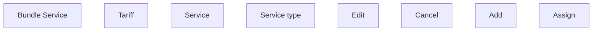

# Services

```mermaid
graph TD
    Bundle_Service["Bundle Service"]
    Tariff["Tariff"]
    Service["Service"]
    Service_type["Service type"]
    Edit["Edit"]
    Cancel["Cancel"]
    Add["Add"]
    Assign["Assign"]
```
