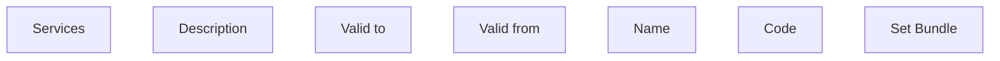

# Set Bundle

```mermaid
graph TD
    Services["Services"]
    Description["Description"]
    Valid_to["Valid to"]
    Valid_from["Valid from"]
    Name["Name"]
    Code["Code"]
    Set_Bundle["Set Bundle"]
```
