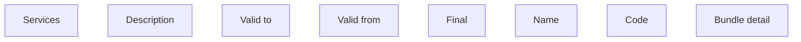

# Show Bundle

- **Diagram Type**: Custom
- **Package**: HomerSelect/BSL/Modules/Product Catalog (PRC)/Analytical Model/Bundle/User Interface for Bundle management
- **Diagram ID**: 159863
- **Elements**: 8
- **Connectors**: 0

