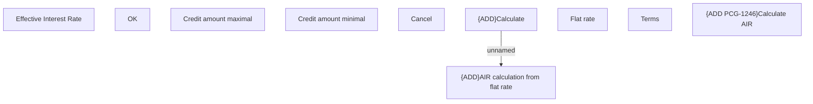

# Calculate AIR

- **Diagram Type**: Custom
- **Package**: HomerSelect/BSL/Modules/Product Catalog (PRC)/Analytical Model/COMMON for Product Catalog/AIR manual calculation/User Interface
- **Diagram ID**: 106515
- **Elements**: 10
- **Connectors**: 1

