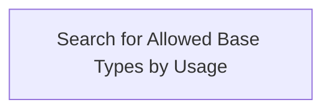

# Base Types

- **Diagram Type**: Custom
- **Package**: HomerSelect/BSL/Modules/Product Catalog (PRC)/Analytical Model/COMMON for Product Catalog/Base Types/Business Rules
- **Diagram ID**: 62877
- **Elements**: 1
- **Connectors**: 0

