# Subvention-Detail

- **Diagram Type**: Custom
- **Package**: HomerSelect/BSL/Modules/Product Catalog (PRC)/Analytical Model/COMMON for Product Catalog/COMMON for Subvention/User Interface
- **Diagram ID**: 158825
- **Elements**: 17
- **Connectors**: 0

```mermaid
graph TD
    ADD_Promo_action["{ADD}Promo action"]
    ADD_Maximal_commodity_price["{ADD}Maximal commodity price"]
    ADD_Minimal_commodity_price["{ADD}Minimal commodity price"]
    ADD_Maximal_goods_price["{ADD}Maximal goods price"]
    ADD_Minimal_goods_price["{ADD}Minimal goods price"]
    Model["Model"]
    Purpose["Purpose"]
    Discount["Discount"]
    Participant["Participant"]
    Allocation_to_client["Allocation to client"]
    Fixed_amount["Fixed amount"]
    Percentage_rate["Percentage rate"]
    Percentage_based_on["Percentage based on"]
    Rounding["Rounding"]
    Rounding_Scale["Rounding Scale"]
    Commodity_type["Commodity type"]
    ADD_Show_Subvention["{ADD}Show Subvention"]
```

