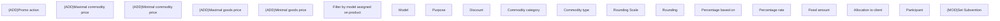

# Subvention-Set

```mermaid
graph TD
    ADD_Promo_action["{ADD}Promo action"]
    ADD_Maximal_commodity_price["{ADD}Maximal commodity price"]
    ADD_Minimal_commodity_price["{ADD}Minimal commodity price"]
    ADD_Maximal_goods_price["{ADD}Maximal goods price"]
    ADD_Minimal_goods_price["{ADD}Minimal goods price"]
    Filter_by_model_assigned_on_product["Filter by model assigned on product"]
    Model["Model"]
    Purpose["Purpose"]
    Discount["Discount"]
    Commodity_category["Commodity category"]
    Commodity_type["Commodity type"]
    Rounding_Scale["Rounding Scale"]
    Rounding["Rounding"]
    Percentage_based_on["Percentage based on"]
    Percentage_rate["Percentage rate"]
    Fixed_amount["Fixed amount"]
    Allocation_to_client["Allocation to client"]
    Participant["Participant"]
    MOD_Set_Subvention["{MOD}Set Subvention"]
```
