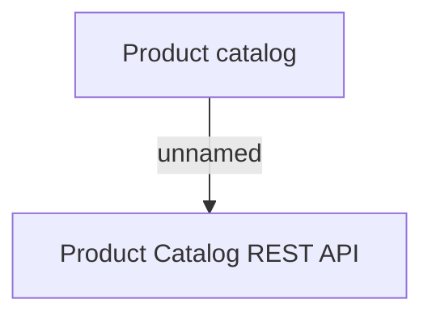

# User Interface

- **Diagram Type**: Custom
- **Package**: HomerSelect/BSL/Modules/Product Catalog (PRC)/Analytical Model/COMMON for Product Catalog/User Interface
- **Diagram ID**: 141784
- **Elements**: 2
- **Connectors**: 1

