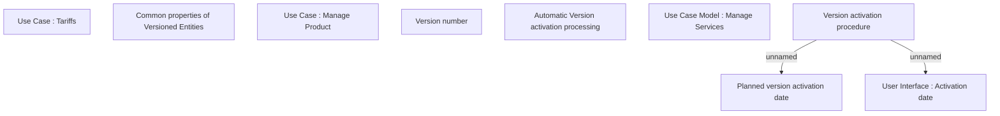

# Business Rules for Versioned Entity

```mermaid
graph TD
    Use_Case_Tariffs["Use Case : Tariffs"]
    Common_properties_of_Versioned_Entities["Common properties of Versioned Entities"]
    User_Interface_Activation_date["User Interface : Activation date"]
    Planned_version_activation_date["Planned version activation date"]
    Use_Case_Manage_Product["Use Case : Manage Product"]
    Version_number["Version number"]
    Automatic_Version_activation_processing["Automatic Version activation processing"]
    Use_Case_Model_Manage_Services["Use Case Model : Manage Services"]
    Version_activation_procedure["Version activation procedure"]
    Version_activation_procedure -->|unnamed| Planned_version_activation_date
    Version_activation_procedure -->|unnamed| User_Interface_Activation_date
```
