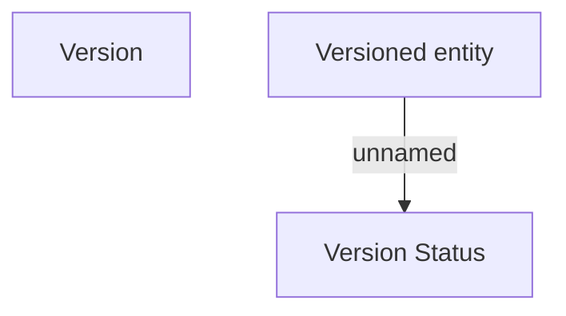

# Versioned entity

- **Diagram Type**: Custom
- **Package**: HomerSelect/BSL/Modules/Product Catalog (PRC)/Analytical Model/COMMON for Product Catalog/Versioned entity/Logical Data Model
- **Diagram ID**: 98415
- **Elements**: 3
- **Connectors**: 1

