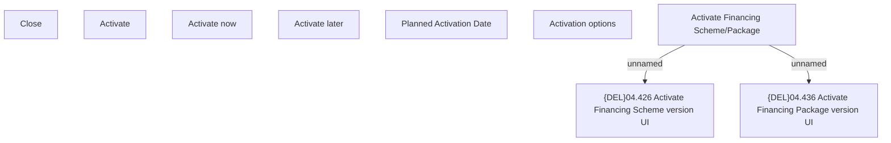

# Activate Financing Scheme/Package

```mermaid
graph TD
    DEL_04_436_Activate_Financing_Package_version_UI["{DEL}04.436 Activate Financing Package version UI"]
    Close["Close"]
    Activate["Activate"]
    DEL_04_426_Activate_Financing_Scheme_version_UI["{DEL}04.426 Activate Financing Scheme version UI"]
    Activate_now["Activate now"]
    Activate_later["Activate later"]
    Planned_Activation_Date["Planned Activation Date"]
    Activation_options["Activation options"]
    Activate_Financing_Scheme_Package["Activate Financing Scheme/Package"]
    Activate_Financing_Scheme_Package -->|unnamed| DEL_04_426_Activate_Financing_Scheme_version_UI
    Activate_Financing_Scheme_Package -->|unnamed| DEL_04_436_Activate_Financing_Package_version_UI
```
