# Financing Package Values - validation rules

- **Diagram Type**: Custom
- **Package**: HomerSelect/BSL/Modules/Product Catalog (PRC)/Analytical Model/Financing Scheme/Financing Package/Provided Services/Validation Rules
- **Diagram ID**: 160715
- **Elements**: 10
- **Connectors**: 8

```mermaid
graph TD
    MOD_FinancingPackageValues_validation_rules["{MOD}FinancingPackageValues - validation rules"]
    FinancingPackageCriterionValuesCombination_validation_rules["FinancingPackageCriterionValuesCombination - validation rules"]
    Financing_Scheme["Financing Scheme"]
    MOD_Financing_Package_Criterion_Type["{MOD}Financing Package Criterion Type"]
    MOD_ValidationCodeFinancingPackageValues["{MOD}ValidationCodeFinancingPackageValues"]
    Commodity_Type["Commodity Type"]
    Financing_Package_Purpose["Financing Package Purpose"]
    Manufacturer["Manufacturer"]
    Get_List_of_Merchants["Get List of Merchants"]
    MOD_Transaction_Type["{MOD}Transaction Type"]
    MOD_FinancingPackageValues_validation_rules -->|unnamed| MOD_Transaction_Type
    MOD_FinancingPackageValues_validation_rules -->|unnamed| Get_List_of_Merchants
    MOD_FinancingPackageValues_validation_rules -->|unnamed| Manufacturer
    MOD_FinancingPackageValues_validation_rules -->|unnamed| Financing_Package_Purpose
    MOD_FinancingPackageValues_validation_rules -->|unnamed| Commodity_Type
    MOD_FinancingPackageValues_validation_rules -->|unnamed| MOD_Financing_Package_Criterion_Type
    MOD_FinancingPackageValues_validation_rules -->|unnamed| Financing_Scheme
    MOD_FinancingPackageValues_validation_rules -->|unnamed| FinancingPackageCriterionValuesCombination_validation_rules
```

