# Set Financing Package Subvention

- **Diagram Type**: Custom
- **Package**: HomerSelect/BSL/Modules/Product Catalog (PRC)/Analytical Model/Financing Scheme/Financing Package/UI for Financing Package Management/User Interface
- **Diagram ID**: 162538
- **Elements**: 12
- **Connectors**: 0

```mermaid
graph TD
    Purpose["Purpose"]
    Allocation_to_client["Allocation to client"]
    Percentage_based_on["Percentage based on"]
    User_Interface_Set_Financing_Package["User Interface : Set Financing Package"]
    Percentage["Percentage"]
    Fixed_Amount["Fixed Amount"]
    Subvention_Scheme["Subvention Scheme"]
    Commodity_category["Commodity category"]
    Commodity_type["Commodity type"]
    Cancel["Cancel"]
    OK["OK"]
    Set_Financing_Package_Subvention["Set Financing Package Subvention"]
```

