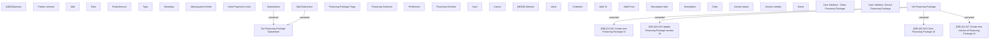

# Set Financing Package

```mermaid
graph TD
    ADD_Operator["{ADD}Operator"]
    Partner_scheme["Partner scheme"]
    Add["Add"]
    Rate["Rate"]
    Fixed_Amount["Fixed Amount"]
    Type["Type"]
    el_1860793["Boundary"]
    Initial_payment_limits["Initial payment limits"]
    Initial_Paymentt_Limits["Initial Paymentt Limits"]
    Set_Financing_Package_Subvention["Set Financing Package Subvention"]
    Subventions["Subventions"]
    Add_Subvention["Add Subvention"]
    Subventions["Subventions"]
    Financing_Package_Flags["Financing Package Flags"]
    Financing_Schemes["Financing Schemes"]
    Add["Add"]
    Preference["Preference"]
    Financing_Scheme["Financing Scheme"]
    Financing_Schemes["Financing Schemes"]
    Save["Save"]
    Cancel["Cancel"]
    MOD_Criterions["{MOD}Criterions"]
    Add["Add"]
    Value["Value"]
    Type["Type"]
    Criterions["Criterions"]
    DEL_04_437_Create_new_version_of_Financing_Package_UI["{DEL}04.437 Create new version of Financing Package UI"]
    DEL_04_434_Clone_Financing_Package_UI["{DEL}04.434 Clone Financing Package UI"]
    DEL_04_432_Update_Financing_Package_version_UI["{DEL}04.432 Update Financing Package version UI"]
    DEL_04_431_Create_new_Financing_Package_UI["{DEL}04.431 Create new Financing Package UI"]
    Valid_To["Valid To"]
    Valid_From["Valid From"]
    Description_Sale["Description Sale"]
    Description["Description"]
    Code["Code"]
    Version_status["Version status"]
    Version_number["Version number"]
    Name["Name"]
    User_Interface_Show_Financing_Package["User Interface : Show Financing Package"]
    User_Interface_Search_Financing_Package["User Interface :Search Financing Package"]
    Set_Financing_Package["Set Financing Package"]
    Set_Financing_Package -->|unnamed| DEL_04_431_Create_new_Financing_Package_UI
    Set_Financing_Package -->|unnamed| DEL_04_432_Update_Financing_Package_version_UI
    Set_Financing_Package -->|unnamed| DEL_04_434_Clone_Financing_Package_UI
    Set_Financing_Package -->|unnamed| DEL_04_437_Create_new_version_of_Financing_Package_UI
    Subventions -->|unnamed| Set_Financing_Package_Subvention
    Add_Subvention -->|unnamed| Set_Financing_Package_Subvention
```
