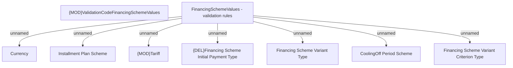

# Financing Scheme Values - validation Rules

- **Diagram Type**: Custom
- **Package**: HomerSelect/BSL/Modules/Product Catalog (PRC)/Analytical Model/Financing Scheme/Financing Scheme/Provided Services/Validation Rules
- **Diagram ID**: 141364
- **Elements**: 9
- **Connectors**: 7

