# Search Financing Scheme

- **Diagram Type**: Custom
- **Package**: HomerSelect/BSL/Modules/Product Catalog (PRC)/Analytical Model/Financing Scheme/Financing Scheme/UI for Financing Scheme Management/User Interface
- **Diagram ID**: 159455
- **Elements**: 17
- **Connectors**: 3

```mermaid
graph TD
    User_Interface_Show_Financing_Scheme["User Interface : Show Financing Scheme"]
    User_Interface_Set_Financing_Scheme["User Interface : Set Financing Scheme"]
    DEL_04_425_Show_Financing_Scheme_version_detail_UI["{DEL}04.425 Show Financing Scheme version detail UI"]
    DEL_04_421_Create_new_Financing_Scheme_UI["{DEL}04.421 Create new Financing Scheme UI"]
    DEL_04_423_Search_Financing_Scheme_UI["{DEL}04.423 Search Financing Scheme UI"]
    Version_activated_to["Version activated to"]
    Version_activated_from["Version activated from"]
    Version_Status["Version Status"]
    Reset["Reset"]
    Search["Search"]
    Search_buttons["Search buttons"]
    MOD_Name["{MOD}Name"]
    MOD_Code["{MOD}Code"]
    Search_for_Financing_Schemes_criteria["Search for Financing Schemes criteria"]
    Create_Financing_Scheme["Create Financing Scheme"]
    List_of_Financing_Schemes["List of Financing Schemes"]
    Search_Financing_Schemes["Search Financing Schemes"]
    Search_Financing_Schemes -->|unnamed| DEL_04_423_Search_Financing_Scheme_UI
    Create_Financing_Scheme -->|unnamed| DEL_04_421_Create_new_Financing_Scheme_UI
    List_of_Financing_Schemes -->|unnamed| DEL_04_425_Show_Financing_Scheme_version_detail_UI
```

