# Set Financing Scheme Variant

- **Diagram Type**: Custom
- **Package**: HomerSelect/BSL/Modules/Product Catalog (PRC)/Analytical Model/Financing Scheme/Financing Scheme/UI for Financing Scheme Management/User Interface
- **Diagram ID**: 159459
- **Elements**: 19
- **Connectors**: 1

```mermaid
graph TD
    ADD_Gift_Payments_AIR["{ADD}Gift Payments AIR"]
    Number_of_Gift_Payment_Terms["Number of Gift Payment Terms"]
    User_Interface_Calculate_AIR["User Interface : Calculate AIR"]
    Calculate_AIR["Calculate AIR"]
    Initial_Past_Due_AIR["Initial Past Due AIR"]
    Past_Due_AIR["Past Due AIR"]
    User_Interface_Set_Financing_Scheme["User Interface : Set Financing Scheme"]
    Maximal_Pricing_Category["Maximal Pricing Category"]
    Minimal_Pricing_Category["Minimal Pricing Category"]
    Cancel["Cancel"]
    OK["OK"]
    Variant_Type["Variant Type"]
    Total_Monthly_Payment["Total Monthly Payment"]
    Term["Term"]
    Initial_Term["Initial Term"]
    MOD_Initial_AIR["{MOD}Initial AIR"]
    MOD_AIR["{MOD}AIR"]
    Variant_Detail["Variant Detail"]
    Set_Financing_Scheme_Variant["Set Financing Scheme Variant"]
    Calculate_AIR -->|unnamed| User_Interface_Calculate_AIR
```

