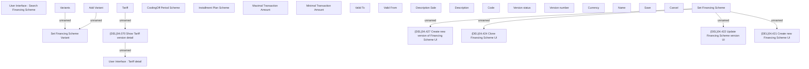

# Set Financing Scheme

```mermaid
graph TD
    Set_Financing_Scheme_Variant["Set Financing Scheme Variant"]
    User_Interface_Tariff_detail["User Interface : Tariff detail"]
    DEL_04_070_Show_Tariff_version_detail["{DEL}04.070 Show Tariff version detail"]
    User_Interface_Search_Financing_Scheme["User Interface : Search Financing Scheme"]
    DEL_04_427_Create_new_version_of_Financing_Scheme_UI["{DEL}04.427 Create new version of Financing Scheme UI"]
    DEL_04_424_Clone_Financing_Scheme_UI["{DEL}04.424 Clone Financing Scheme UI"]
    DEL_04_422_Update_Financing_Scheme_version_UI["{DEL}04.422 Update Financing Scheme version UI"]
    Add_Variant["Add Variant"]
    Variants["Variants"]
    Tariff["Tariff"]
    CoolingOff_Period_Scheme["CoolingOff Period Scheme"]
    Installment_Plan_Scheme["Installment Plan Scheme"]
    Maximal_Transaction_Amount["Maximal Transaction Amount"]
    Minimal_Transaction_Amount["Minimal Transaction Amount"]
    Valid_To["Valid To"]
    Valid_From["Valid From"]
    Description_Sale["Description Sale"]
    Description["Description"]
    Code["Code"]
    DEL_04_421_Create_new_Financing_Scheme_UI["{DEL}04.421 Create new Financing Scheme UI"]
    Version_status["Version status"]
    Version_number["Version number"]
    Currency["Currency"]
    Name["Name"]
    Save["Save"]
    Cancel["Cancel"]
    Variants["Variants"]
    Set_Financing_Scheme["Set Financing Scheme"]
    Set_Financing_Scheme -->|unnamed| DEL_04_421_Create_new_Financing_Scheme_UI
    Set_Financing_Scheme -->|unnamed| DEL_04_422_Update_Financing_Scheme_version_UI
    Set_Financing_Scheme -->|unnamed| DEL_04_424_Clone_Financing_Scheme_UI
    Set_Financing_Scheme -->|unnamed| DEL_04_427_Create_new_version_of_Financing_Scheme_UI
    Tariff -->|unnamed| DEL_04_070_Show_Tariff_version_detail
    Variants -->|unnamed| Set_Financing_Scheme_Variant
    Add_Variant -->|unnamed| Set_Financing_Scheme_Variant
    DEL_04_070_Show_Tariff_version_detail -->|unnamed| User_Interface_Tariff_detail
```
