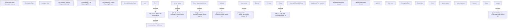

# Show Financing Scheme

```mermaid
graph TD
    ADD_Show_Sales_Description_on_entity["{ADD}Show Sales Description on entity"]
    User_Interface_Tariff_detail["User Interface : Tariff detail"]
    DEL_04_070_Show_Tariff_version_detail["{DEL}04.070 Show Tariff version detail"]
    Termination_Date["Termination Date"]
    Activation_Date["Activation Date"]
    User_Interface_Activate_Financing_Scheme["User Interface : Activate Financing Scheme"]
    User_Interface_Set_Financing_Scheme["User Interface : Set Financing Scheme"]
    User_Interface_Search_Financing_Scheme["User Interface : Search Financing Scheme"]
    Planned_Activation_Date["Planned Activation Date"]
    DEL_04_428_Cancel_Financing_Scheme_version_UI["{DEL}04.428 Cancel Financing Scheme version UI"]
    DEL_04_425_Show_Financing_Scheme_version_detail_UI["{DEL}04.425 Show Financing Scheme version detail UI"]
    DEL_04_426_Activate_Financing_Scheme_version_UI["{DEL}04.426 Activate Financing Scheme version UI"]
    DEL_04_427_Create_new_version_of_Financing_Scheme_UI["{DEL}04.427 Create new version of Financing Scheme UI"]
    DEL_04_424_Clone_Financing_Scheme_UI["{DEL}04.424 Clone Financing Scheme UI"]
    DEL_04_422_Update_Financing_Scheme_version_UI["{DEL}04.422 Update Financing Scheme version UI"]
    Back["Back"]
    New_version["New version"]
    Clone["Clone"]
    Update["Update"]
    Cancel_version["Cancel version"]
    Activate["Activate"]
    Buttons["Buttons"]
    Variants["Variants"]
    Variants["Variants"]
    Tariff["Tariff"]
    CoolingOff_Period_Scheme["CoolingOff Period Scheme"]
    Installment_Plan_Scheme["Installment Plan Scheme"]
    Maximal_Transaction_Amount["Maximal Transaction Amount"]
    Minimal_Transaction_Amount["Minimal Transaction Amount"]
    Valid_To["Valid To"]
    Valid_From["Valid From"]
    Description_Sale["Description Sale"]
    Description["Description"]
    Code["Code"]
    Version_status["Version status"]
    Version_number["Version number"]
    Currency["Currency"]
    Name["Name"]
    Show_Financing_Scheme["Show Financing Scheme"]
    Update -->|unnamed| DEL_04_422_Update_Financing_Scheme_version_UI
    Clone -->|unnamed| DEL_04_424_Clone_Financing_Scheme_UI
    New_version -->|unnamed| DEL_04_427_Create_new_version_of_Financing_Scheme_UI
    Activate -->|unnamed| DEL_04_426_Activate_Financing_Scheme_version_UI
    Show_Financing_Scheme -->|unnamed| DEL_04_425_Show_Financing_Scheme_version_detail_UI
    Cancel_version -->|unnamed| DEL_04_428_Cancel_Financing_Scheme_version_UI
    Tariff -->|unnamed| DEL_04_070_Show_Tariff_version_detail
    DEL_04_070_Show_Tariff_version_detail -->|unnamed| User_Interface_Tariff_detail
```
