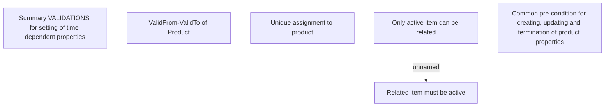

# Product setting common rules

```mermaid
graph TD
    Summary_VALIDATIONS_for_setting_of_time_dependent_properties["Summary VALIDATIONS for setting of time dependent properties"]
    ValidFrom_ValidTo_of_Product["ValidFrom-ValidTo of Product"]
    Unique_assignment_to_product["Unique assignment to product"]
    Only_active_item_can_be_related["Only active item can be related"]
    Related_item_must_be_active["Related item must be active"]
    Common_pre_condition_for_creating_updating_and_termination_o["Common pre-condition for creating, updating and termination of product properties "]
    Only_active_item_can_be_related -->|unnamed| Related_item_must_be_active
```
