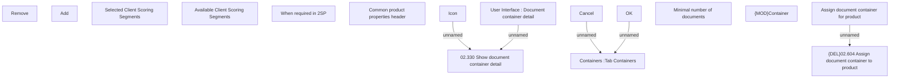

# Containers-Assign

```mermaid
graph TD
    Remove["Remove"]
    Add["Add"]
    Selected_Client_Scoring_Segments["Selected Client Scoring Segments"]
    Available_Client_Scoring_Segments["Available Client Scoring Segments"]
    When_required_in_2SP["When required in 2SP"]
    Common_product_properties_header["Common product properties header"]
    User_Interface_Document_container_detail["User Interface : Document container detail"]
    n_02_330_Show_document_container_detail["02.330 Show document container detail"]
    Icon["Icon"]
    Containers_Tab_Containers["Containers :Tab Containers"]
    OK["OK"]
    Cancel["Cancel"]
    DEL_02_604_Assign_document_container_to_product["{DEL}02.604 Assign document container to product"]
    Minimal_number_of_documents["Minimal number of documents"]
    MOD_Container["{MOD}Container"]
    Assign_document_container_for_product["Assign document container for product"]
    Assign_document_container_for_product -->|unnamed| DEL_02_604_Assign_document_container_to_product
    Cancel -->|unnamed| Containers_Tab_Containers
    OK -->|unnamed| Containers_Tab_Containers
    Icon -->|unnamed| n_02_330_Show_document_container_detail
    User_Interface_Document_container_detail -->|unnamed| n_02_330_Show_document_container_detail
```
