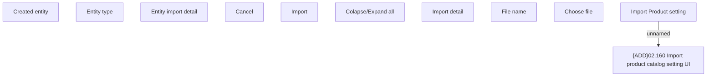

# Import product setting

- **Diagram Type**: Custom
- **Package**: HomerSelect/BSL/Modules/Product Catalog (PRC)/Analytical Model/Product/User Interface for Product Management/Import product settings/User Interface
- **Diagram ID**: 163650
- **Elements**: 11
- **Connectors**: 1

