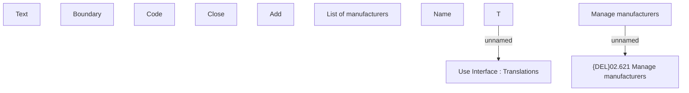

# Manage Manufacturers

```mermaid
graph TD
    DEL_02_621_Manage_manufacturers["{DEL}02.621 Manage manufacturers"]
    Use_Interface_Translations["Use Interface : Translations"]
    el_1434226["Text"]
    el_1434239["Boundary"]
    Code["Code"]
    Close["Close"]
    Add["Add"]
    List_of_manufacturers["List of manufacturers"]
    Name["Name"]
    T["T"]
    Manage_manufacturers["Manage manufacturers"]
    T -->|unnamed| Use_Interface_Translations
    Manage_manufacturers -->|unnamed| DEL_02_621_Manage_manufacturers
```
