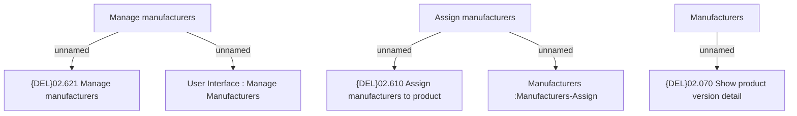

# Tab Manufacturers

```mermaid
graph TD
    User_Interface_Manage_Manufacturers["User Interface : Manage Manufacturers"]
    DEL_02_621_Manage_manufacturers["{DEL}02.621 Manage manufacturers"]
    Manage_manufacturers["Manage manufacturers"]
    Manufacturers_Manufacturers_Assign["Manufacturers :Manufacturers-Assign"]
    DEL_02_610_Assign_manufacturers_to_product["{DEL}02.610 Assign manufacturers to product"]
    Assign_manufacturers["Assign manufacturers"]
    Manufacturers["Manufacturers"]
    Manufacturers["Manufacturers"]
    DEL_02_070_Show_product_version_detail["{DEL}02.070 Show product version detail"]
    Manufacturers -->|unnamed| DEL_02_070_Show_product_version_detail
    Assign_manufacturers -->|unnamed| DEL_02_610_Assign_manufacturers_to_product
    Assign_manufacturers -->|unnamed| Manufacturers_Manufacturers_Assign
    Manage_manufacturers -->|unnamed| DEL_02_621_Manage_manufacturers
    Manage_manufacturers -->|unnamed| User_Interface_Manage_Manufacturers
```
