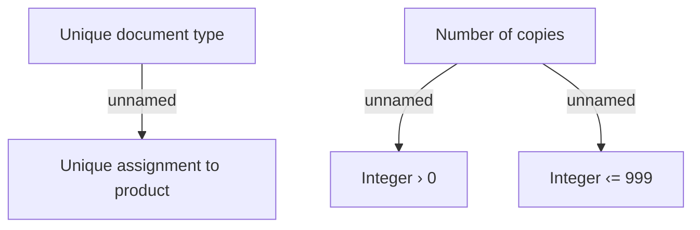

# Business Rules 

```mermaid
graph TD
    Integer_999["Integer ‹= 999"]
    Unique_assignment_to_product["Unique assignment to product"]
    Unique_document_type["Unique document type"]
    Integer_0["Integer › 0"]
    Number_of_copies["Number of copies"]
    Number_of_copies -->|unnamed| Integer_0
    Number_of_copies -->|unnamed| Integer_999
    Unique_document_type -->|unnamed| Unique_assignment_to_product
```
