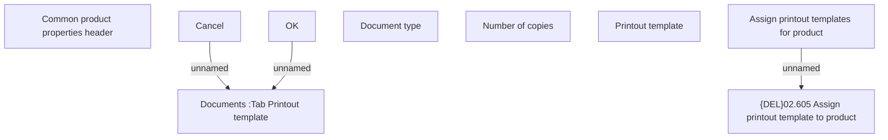

# Printout template-Assign

- **Diagram Type**: Custom
- **Package**: HomerSelect/BSL/Modules/Product Catalog (PRC)/Analytical Model/Product/User Interface for Product Management/Printout Template Assignment/User Interface
- **Diagram ID**: 71266
- **Elements**: 9
- **Connectors**: 3

