# Set main Product Profile properties

- **Diagram Type**: Custom
- **Package**: HomerSelect/BSL/Modules/Product Catalog (PRC)/Analytical Model/Product/User Interface for Product Management/Product Profile/User Interface
- **Diagram ID**: 156489
- **Elements**: 26
- **Connectors**: 4

```mermaid
graph TD
    Business_Category["Business Category"]
    Take_in_account_that_only_one_Documention_Configuration_can_["Take in account that only one Documention Configuration can be selected"]
    Documentation_Configuration["Documentation Configuration"]
    Application_Form_Configuration["Application Form Configuration"]
    DEL_Main_Product_Profile_properties_validation_rules["{DEL}}Main Product Profile properties - validation rules"]
    Installment_Schedule_Method_alternative["Installment Schedule Method alternative"]
    MOD_Installment_Schedule_Method_default["{MOD}Installment Schedule Method default"]
    Max_Documents_Preparation_Period["Max.Documents Preparation Period"]
    Max_Validity_of_Prepared_Documents["Max.Validity of Prepared Documents"]
    First_Day_of_Billing_Period_Algorithm["First Day of Billing Period Algorithm"]
    Max_Duration["Max.Duration"]
    First_Due_Date_Algorithm["First Due Date Algorithm"]
    Contract_Negotiation_Process["Contract Negotiation Process"]
    MOD_Day_Count_Method["{MOD}Day Count Method"]
    Accounting_Method["Accounting Method"]
    Is_Debit["Is Debit"]
    Initial_transaction_type["Initial transaction type"]
    Active["Active"]
    Code["Code"]
    Product_type["Product type"]
    Name["Name"]
    User_Interface_Show_Product_Profile["User Interface : Show Product Profile"]
    DEL_02_015_Set_main_Product_Profile_properties["{DEL}02.015 Set main Product Profile properties"]
    Cancel["Cancel"]
    OK["OK"]
    Set_main_Product_Profile_properties["Set main Product Profile properties"]
    Set_main_Product_Profile_properties -->|unnamed| DEL_02_015_Set_main_Product_Profile_properties
    Cancel -->|unnamed| User_Interface_Show_Product_Profile
    OK -->|unnamed| User_Interface_Show_Product_Profile
    DEL_02_015_Set_main_Product_Profile_properties -->|unnamed| DEL_Main_Product_Profile_properties_validation_rules
```

