# Show Product Profile

- **Diagram Type**: Custom
- **Package**: HomerSelect/BSL/Modules/Product Catalog (PRC)/Analytical Model/Product/User Interface for Product Management/Product Profile/User Interface
- **Diagram ID**: 156487
- **Elements**: 28
- **Connectors**: 3

```mermaid
graph TD
    Business_Category["Business Category"]
    Documentation_Configuration["Documentation Configuration"]
    Application_Form_Configuration["Application Form Configuration"]
    Installment_Schedule_Method_alternative["Installment Schedule Method alternative"]
    Installment_Schedule_Method_default["Installment Schedule Method default"]
    Max_Documents_Preparation_Period["Max.Documents Preparation Period"]
    Max_Validity_of_Prepared_Documents["Max.Validity of Prepared Documents"]
    First_Day_of_Billing_Period_Algorithm["First Day of Billing Period Algorithm"]
    Max_Duration["Max.Duration"]
    First_Due_Date_Algorithm["First Due Date Algorithm"]
    Contract_Negotiation_Process["Contract Negotiation Process"]
    Day_Count_Method["Day Count Method"]
    Accounting_Method["Accounting Method"]
    Is_Debit["Is Debit"]
    Last_update["Last update"]
    DEL_02_014_Show_Product_Profile_detail["{DEL}02.014 Show Product Profile detail"]
    DEL_02_015_Set_main_Product_Profile_properties["{DEL}02.015 Set main Product Profile properties"]
    DEL_02_013_Clone_Product_Profile["{DEL}02.013 Clone Product Profile"]
    Clone["Clone"]
    Update["Update"]
    Buttons["Buttons"]
    Initial_transaction_type["Initial transaction type"]
    Active["Active"]
    Code["Code"]
    Product_type["Product type"]
    Name["Name"]
    Common_product_information["Common product information"]
    Product_Profile["Product Profile"]
    Clone -->|unnamed| DEL_02_013_Clone_Product_Profile
    Update -->|unnamed| DEL_02_015_Set_main_Product_Profile_properties
    Product_Profile -->|unnamed| DEL_02_014_Show_Product_Profile_detail
```

