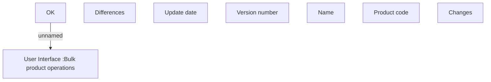

# Changes

```mermaid
graph TD
    User_Interface_Bulk_product_operations["User Interface :Bulk product operations"]
    OK["OK"]
    Differences["Differences"]
    Update_date["Update date"]
    Version_number["Version number"]
    Name["Name"]
    Product_code["Product code"]
    Changes["Changes"]
    OK -->|unnamed| User_Interface_Bulk_product_operations
```
