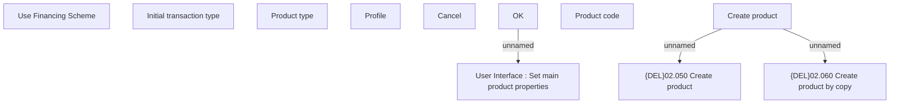

# Create product

```mermaid
graph TD
    Use_Financing_Scheme["Use Financing Scheme"]
    Initial_transaction_type["Initial transaction type"]
    Product_type["Product type"]
    Profile["Profile"]
    User_Interface_Set_main_product_properties["User Interface : Set main product properties"]
    Cancel["Cancel"]
    OK["OK"]
    Product_code["Product code"]
    DEL_02_060_Create_product_by_copy["{DEL}02.060 Create product by copy"]
    DEL_02_050_Create_product["{DEL}02.050 Create product"]
    Create_product["Create product"]
    Create_product -->|unnamed| DEL_02_050_Create_product
    Create_product -->|unnamed| DEL_02_060_Create_product_by_copy
    OK -->|unnamed| User_Interface_Set_main_product_properties
```
