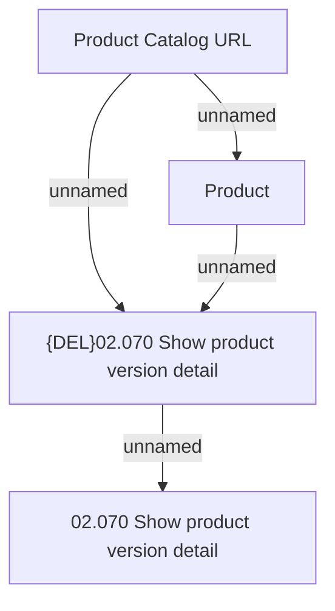

# Product Root URL

```mermaid
graph TD
    n_02_070_Show_product_version_detail["02.070 Show product version detail"]
    Product["Product"]
    DEL_02_070_Show_product_version_detail["{DEL}02.070 Show product version detail"]
    Product_Catalog_URL["Product Catalog URL"]
    Product_Catalog_URL -->|unnamed| DEL_02_070_Show_product_version_detail
    Product -->|unnamed| DEL_02_070_Show_product_version_detail
    Product_Catalog_URL -->|unnamed| Product
    DEL_02_070_Show_product_version_detail -->|unnamed| n_02_070_Show_product_version_detail
```
