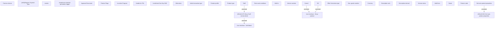

# Set main product properties

```mermaid
graph TD
    Partner_scheme["Partner scheme"]
    ADD_Regular_Payment_Type["{ADD}Regular Payment Type"]
    Lender["Lender"]
    Installment_schedule_generation_trigger["Installment schedule generation trigger"]
    Approval_Document["Approval Document"]
    Product_Flags["Product Flags"]
    Incentive_Program["Incentive Program"]
    Usable_for_PSL["Usable for PSL"]
    Installment_Due_Day_Shift["Installment Due Day Shift"]
    Alternative["Alternative"]
    Initial_transaction_type["Initial transaction type"]
    Product_profile["Product profile"]
    Product_type["Product type"]
    Tariff["Tariff"]
    User_Interface_Tariff_detail["User Interface : Tariff detail"]
    DEL_04_070_Show_Tariff_version_detail["{DEL}04.070 Show Tariff version detail"]
    Terms_and_conditions["Terms and conditions"]
    Tariff["Tariff"]
    Valid_to["Valid to"]
    Version_number["Version number"]
    User_Interface_Show_product["User Interface : Show product"]
    Cancel["Cancel"]
    OK["OK"]
    DEL_02_601_Set_main_product_properties["{DEL}02.601 Set main product properties"]
    Offer_Calculation_type["Offer Calculation type"]
    Max_goods_number["Max. goods number"]
    Currency["Currency"]
    Description_sale["Description sale"]
    Description_internal["Description internal"]
    Version_status["Version status"]
    Valid_from["Valid from"]
    Name["Name"]
    Product_code["Product code"]
    Set_main_product_properties["Set main product properties"]
    Set_main_product_properties -->|unnamed| DEL_02_601_Set_main_product_properties
    Cancel -->|unnamed| User_Interface_Show_product
    OK -->|unnamed| User_Interface_Show_product
    Tariff -->|unnamed| DEL_04_070_Show_Tariff_version_detail
    DEL_04_070_Show_Tariff_version_detail -->|unnamed| User_Interface_Tariff_detail
```
