# Show product

- **Diagram Type**: Custom
- **Package**: HomerSelect/BSL/Modules/Product Catalog (PRC)/Analytical Model/Product/User Interface for Product Management/Product Root/User Interface
- **Diagram ID**: 163640
- **Elements**: 62
- **Connectors**: 11

```mermaid
graph TD
    ADD_02_150_Export_product_catalog_setting_UI["{ADD}02.150 Export product catalog setting UI"]
    ADD_Export["{ADD}Export"]
    ADD_Show_Sales_Description_on_entity["{ADD}Show Sales Description on entity"]
    Partner_scheme["Partner scheme"]
    Regular_Payment_Type["Regular Payment Type"]
    Lender["Lender"]
    diagram_DF9D0807_5DB1_4bf3_B6EB_8DE966E65BAC["$diagram://{DF9D0807-5DB1-4bf3-B6EB-8DE966E65BAC}"]
    DEL_02_014_Show_Product_Profile_detail["{DEL}02.014 Show Product Profile detail"]
    Installment_schedule_generation_trigger["Installment schedule generation trigger"]
    Product_Sets["Product Sets"]
    Flags["Flags"]
    Approval_Document["Approval Document"]
    Use_Financing_Scheme["Use Financing Scheme"]
    Financing_Packages["Financing Packages"]
    Incentive_Program["Incentive Program"]
    Usable_for_PSL["Usable for PSL"]
    Installment_Due_Day_Shift["Installment Due Day Shift"]
    Sales_Areas["Sales Areas"]
    Initial_transaction_type["Initial transaction type"]
    Alternative["Alternative"]
    Planned_activation_date["Planned activation date"]
    Version_terminated["Version terminated"]
    Version_activated["Version activated"]
    Version_number["Version number"]
    Tariff["Tariff"]
    Insurances["Insurances"]
    Services["Services"]
    Marketing_actions["Marketing actions"]
    User_Interface_Tariff_detail["User Interface : Tariff detail"]
    DEL_04_070_Show_Tariff_version_detail["{DEL}04.070 Show Tariff version detail"]
    Terms_Conditions["TermsandConditions"]
    Code["Code"]
    Max_goods_number["Max. goods number"]
    Description_sale["Description sale"]
    Description_internal["Description internal"]
    Currency["Currency"]
    Version_status["Version status"]
    DEL_02_085_Cancel_product_version["{DEL}02.085 Cancel product version"]
    DEL_02_601_Set_main_product_properties["{DEL}02.601 Set main product properties"]
    DEL_02_060_Create_product_by_copy["{DEL}02.060 Create product by copy"]
    New_version["New version"]
    Copy_product["Copy product"]
    Update["Update"]
    Cancel_version["Cancel version"]
    Activate["Activate"]
    Buttons["Buttons"]
    Subventions["Subventions"]
    Valid_to["Valid to"]
    Valid_from["Valid from"]
    DEL_02_070_Show_product_version_detail["{DEL}02.070 Show product version detail"]
    DEL_02_080_Create_product_version["{DEL}02.080 Create product version"]
    Manufacturers["Manufacturers"]
    DEL_02_260_Activate_product_version_manually["{DEL}02.260 Activate product version manually"]
    Product_type["Product type"]
    Name["Name"]
    Product_profile["Product profile"]
    Common_product_information["Common product information"]
    Containers["Containers"]
    Commodities["Commodities"]
    Printout_templates["Printout templates"]
    Variants["Variants"]
    Product["Product"]
    Activate -->|unnamed| DEL_02_260_Activate_product_version_manually
    New_version -->|unnamed| DEL_02_080_Create_product_version
    Product -->|unnamed| DEL_02_070_Show_product_version_detail
    Copy_product -->|unnamed| DEL_02_060_Create_product_by_copy
    Update -->|unnamed| DEL_02_601_Set_main_product_properties
    Cancel_version -->|unnamed| DEL_02_085_Cancel_product_version
    Tariff -->|unnamed| DEL_04_070_Show_Tariff_version_detail
    DEL_04_070_Show_Tariff_version_detail -->|unnamed| User_Interface_Tariff_detail
    Product_profile -->|unnamed| DEL_02_014_Show_Product_Profile_detail
    diagram_DF9D0807_5DB1_4bf3_B6EB_8DE966E65BAC -->|unnamed| DEL_02_014_Show_Product_Profile_detail
    ADD_Export -->|unnamed| ADD_02_150_Export_product_catalog_setting_UI
```

