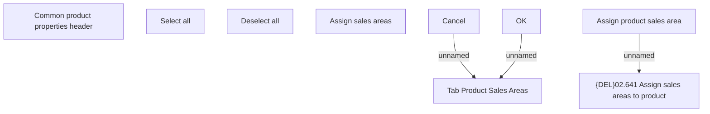

# Product Sales Area-Assign

```mermaid
graph TD
    Tab_Product_Sales_Areas["Tab Product Sales Areas"]
    DEL_02_641_Assign_sales_areas_to_product["{DEL}02.641 Assign sales areas to product"]
    Common_product_properties_header["Common product properties header"]
    Select_all["Select all"]
    Deselect_all["Deselect all"]
    Assign_sales_areas["Assign sales areas"]
    Cancel["Cancel"]
    OK["OK"]
    Assign_product_sales_area["Assign product sales area"]
    Assign_product_sales_area -->|unnamed| DEL_02_641_Assign_sales_areas_to_product
    Cancel -->|unnamed| Tab_Product_Sales_Areas
    OK -->|unnamed| Tab_Product_Sales_Areas
```
