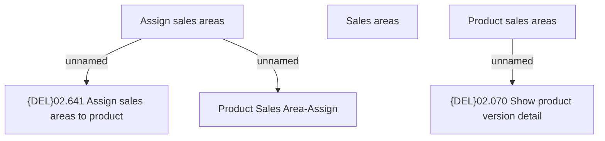

# Tab Product Sales Areas

```mermaid
graph TD
    Product_Sales_Area_Assign["Product Sales Area-Assign"]
    DEL_02_641_Assign_sales_areas_to_product["{DEL}02.641 Assign sales areas to product"]
    DEL_02_070_Show_product_version_detail["{DEL}02.070 Show product version detail"]
    Assign_sales_areas["Assign sales areas"]
    Sales_areas["Sales areas"]
    Product_sales_areas["Product sales areas"]
    Product_sales_areas -->|unnamed| DEL_02_070_Show_product_version_detail
    Assign_sales_areas -->|unnamed| DEL_02_641_Assign_sales_areas_to_product
    Assign_sales_areas -->|unnamed| Product_Sales_Area_Assign
```
