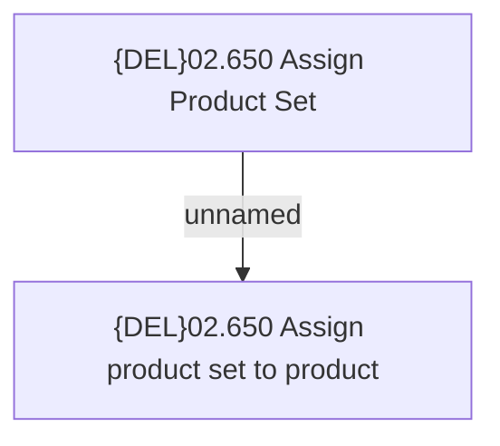

# Access Rights

- **Diagram Type**: Custom
- **Package**: HomerSelect/BSL/Modules/Product Catalog (PRC)/Analytical Model/Product/User Interface for Product Management/Product Set/Access Rights
- **Diagram ID**: 162501
- **Elements**: 2
- **Connectors**: 1

