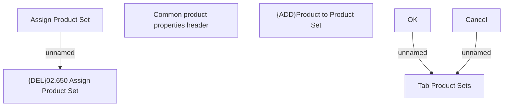

# Product Set - Assign

```mermaid
graph TD
    Assign_Product_Set["Assign Product Set"]
    Common_product_properties_header["Common product properties header"]
    ADD_Product_to_Product_Set["{ADD}Product to Product Set"]
    OK["OK"]
    Cancel["Cancel"]
    DEL_02_650_Assign_Product_Set["{DEL}02.650 Assign Product Set"]
    Tab_Product_Sets["Tab Product Sets"]
    Assign_Product_Set -->|unnamed| DEL_02_650_Assign_Product_Set
    OK -->|unnamed| Tab_Product_Sets
    Cancel -->|unnamed| Tab_Product_Sets
```
