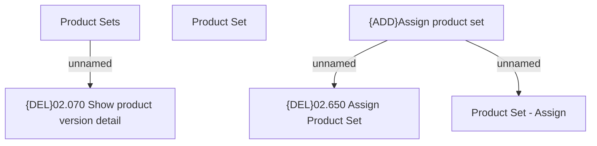

# Tab Product Sets

```mermaid
graph TD
    Product_Sets["Product Sets"]
    Product_Set["Product Set"]
    ADD_Assign_product_set["{ADD}Assign product set"]
    DEL_02_650_Assign_Product_Set["{DEL}02.650 Assign Product Set"]
    Product_Set_Assign["Product Set - Assign"]
    DEL_02_070_Show_product_version_detail["{DEL}02.070 Show product version detail"]
    ADD_Assign_product_set -->|unnamed| DEL_02_650_Assign_Product_Set
    ADD_Assign_product_set -->|unnamed| Product_Set_Assign
    Product_Sets -->|unnamed| DEL_02_070_Show_product_version_detail
```
