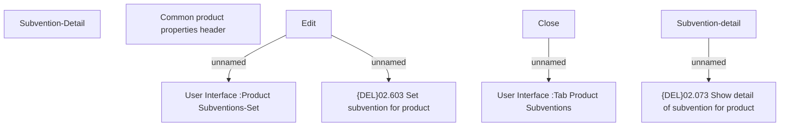

# Product Subventions-Detail

```mermaid
graph TD
    Subvention_Detail["Subvention-Detail"]
    Common_product_properties_header["Common product properties header"]
    DEL_02_603_Set_subvention_for_product["{DEL}02.603 Set subvention for product"]
    User_Interface_Product_Subventions_Set["User Interface :Product Subventions-Set"]
    Edit["Edit"]
    User_Interface_Tab_Product_Subventions["User Interface :Tab Product Subventions"]
    DEL_02_073_Show_detail_of_subvention_for_product["{DEL}02.073 Show detail of subvention for product"]
    Close["Close"]
    Subvention_detail["Subvention-detail"]
    Subvention_detail -->|unnamed| DEL_02_073_Show_detail_of_subvention_for_product
    Close -->|unnamed| User_Interface_Tab_Product_Subventions
    Edit -->|unnamed| User_Interface_Product_Subventions_Set
    Edit -->|unnamed| DEL_02_603_Set_subvention_for_product
```
