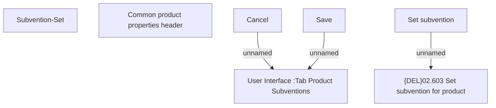

# Product Subventions-Set

- **Diagram Type**: Custom
- **Package**: HomerSelect/BSL/Modules/Product Catalog (PRC)/Analytical Model/Product/User Interface for Product Management/Product Subvention/User Interface
- **Diagram ID**: 142277
- **Elements**: 7
- **Connectors**: 3

