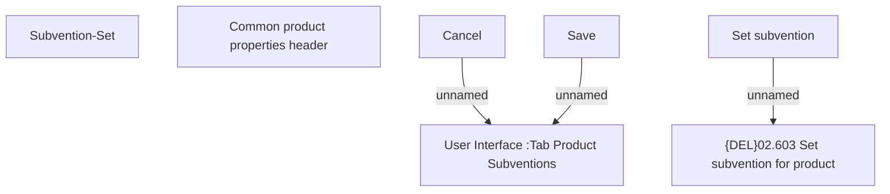

# Product Subventions-Set

```mermaid
graph TD
    Subvention_Set["Subvention-Set"]
    Common_product_properties_header["Common product properties header"]
    User_Interface_Tab_Product_Subventions["User Interface :Tab Product Subventions"]
    Cancel["Cancel"]
    Save["Save"]
    DEL_02_603_Set_subvention_for_product["{DEL}02.603 Set subvention for product"]
    Set_subvention["Set subvention"]
    Set_subvention -->|unnamed| DEL_02_603_Set_subvention_for_product
    Cancel -->|unnamed| User_Interface_Tab_Product_Subventions
    Save -->|unnamed| User_Interface_Tab_Product_Subventions
```
