# Tab Product Subventions

- **Diagram Type**: Custom
- **Package**: HomerSelect/BSL/Modules/Product Catalog (PRC)/Analytical Model/Product/User Interface for Product Management/Product Subvention/User Interface
- **Diagram ID**: 142279
- **Elements**: 9
- **Connectors**: 8

```mermaid
graph TD
    DEL_02_070_Show_product_version_detail["{DEL}02.070 Show product version detail"]
    DEL_02_073_Show_detail_of_subvention_for_product["{DEL}02.073 Show detail of subvention for product"]
    User_Interface_Product_Subventions_Detail["User Interface :Product Subventions-Detail"]
    User_Interface_Product_Subventions_Set["User Interface :Product Subventions-Set"]
    DEL_02_643_Remove_subvention_for_product["{DEL}02.643 Remove subvention for product"]
    DEL_02_603_Set_subvention_for_product["{DEL}02.603 Set subvention for product"]
    Add_subvention["Add subvention"]
    MOD_Subventions["{MOD}Subventions"]
    Product_Subventions["Product Subventions"]
    Add_subvention -->|unnamed| DEL_02_603_Set_subvention_for_product
    Add_subvention -->|unnamed| User_Interface_Product_Subventions_Set
    Product_Subventions -->|unnamed| DEL_02_070_Show_product_version_detail
    MOD_Subventions -->|unnamed| DEL_02_643_Remove_subvention_for_product
    MOD_Subventions -->|unnamed| DEL_02_073_Show_detail_of_subvention_for_product
    MOD_Subventions -->|unnamed| DEL_02_603_Set_subvention_for_product
    MOD_Subventions -->|unnamed| User_Interface_Product_Subventions_Set
    MOD_Subventions -->|unnamed| User_Interface_Product_Subventions_Detail
```

