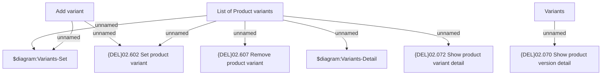

# Tab Variants

- **Diagram Type**: Custom
- **Package**: HomerSelect/BSL/Modules/Product Catalog (PRC)/Analytical Model/Product/User Interface for Product Management/Product Variant/User Interface
- **Diagram ID**: 156491
- **Elements**: 9
- **Connectors**: 8

