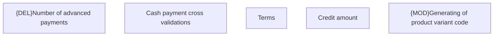

# Validation Rules

```mermaid
graph TD
    DEL_Number_of_advanced_payments["{DEL}Number of advanced payments"]
    Cash_payment_cross_validations["Cash payment cross validations"]
    Terms["Terms"]
    Credit_amount["Credit amount"]
    MOD_Generating_of_product_variant_code["{MOD}Generating of product variant code"]
```
