# Variants-Detail

- **Diagram Type**: Custom
- **Package**: HomerSelect/BSL/Modules/Product Catalog (PRC)/Analytical Model/Product/User Interface for Product Management/Product Variant/User Interface
- **Diagram ID**: 156492
- **Elements**: 34
- **Connectors**: 4

```mermaid
graph TD
    ADD_Annual_interest_rate["{ADD}Annual interest rate"]
    Terms["Terms"]
    Standalone_Insurance["Standalone Insurance"]
    Min_Cash_Down_payment_amount["Min Cash/Down payment amount"]
    Cash_Down_payment_calculation_method["Cash/Down payment calculation method"]
    Min_Cash_Down_payment_rate["Min Cash/Down payment rate"]
    Max_Cash_Down_payment_rate["Max Cash/Down payment rate"]
    Max_Cash_Down_payment_amount["Max Cash/Down payment amount"]
    Cash_Payment_parameters["Cash Payment parameters"]
    Pricing_category_to["Pricing category to"]
    Pricing_category_from["Pricing category from"]
    Statement_Printout_Template["Statement Printout Template"]
    Installment_Prescription_Min_Limit["Installment Prescription Min Limit"]
    Min_Installment_Rounding_Scale["Min Installment Rounding Scale"]
    Min_Installment_Rounding["Min Installment Rounding"]
    Terms["Terms"]
    Annual_interest_rate["Annual interest rate"]
    Min_Installment_Fixed_Amount["Min Installment Fixed Amount"]
    Min_Installment_Rate["Min Installment Rate"]
    Min_Installment_Base["Min Installment Base"]
    Revolving_loan["Revolving loan"]
    Common_product_properties_header["Common product properties header"]
    Closed_end_loan["Closed end loan "]
    Variants_and_subventions_Tab_Variants["Variants and subventions :Tab Variants"]
    DEL_02_602_Set_product_variant["{DEL}02.602 Set product variant"]
    Credit_amount_minimal["Credit amount minimal"]
    DEL_02_072_Show_product_variant_detail["{DEL}02.072 Show product variant detail"]
    Edit["Edit"]
    Variants_and_subventions_Variants_Set["Variants and subventions :Variants-Set"]
    Close["Close"]
    Credit_amount_maximal["Credit amount maximal"]
    Variant_code["Variant code"]
    Preference["Preference"]
    Product_variant_detail["Product variant - detail"]
    Edit -->|unnamed| Variants_and_subventions_Variants_Set
    Product_variant_detail -->|unnamed| DEL_02_072_Show_product_variant_detail
    Edit -->|unnamed| DEL_02_602_Set_product_variant
    Close -->|unnamed| Variants_and_subventions_Tab_Variants
```

