# Variants-Set

- **Diagram Type**: Custom
- **Package**: HomerSelect/BSL/Modules/Product Catalog (PRC)/Analytical Model/Product/User Interface for Product Management/Product Variant/User Interface
- **Diagram ID**: 156493
- **Elements**: 34
- **Connectors**: 4

```mermaid
graph TD
    ADD_Annual_interest_rate["{ADD}Annual interest rate"]
    MOD_Terms["{MOD}Terms"]
    Standalone_Insurance["Standalone Insurance"]
    User_Interface_Calculate_AIR["User Interface : Calculate AIR"]
    Calculate_AIR["Calculate AIR"]
    Min_Cash_Down_payment_rate["Min Cash/Down payment rate"]
    Min_Cash_Down_payment_amount["Min Cash/Down payment amount"]
    Cash_Down_payment_calculation_method["Cash/Down payment calculation method"]
    Max_Cash_Down_payment_amount["Max Cash/Down payment amount"]
    Max_Cash_Down_payment_rate["Max Cash/Down payment rate"]
    Cash_Payment_parameters["Cash Payment parameters"]
    Pricing_category_to["Pricing category to"]
    Pricing_category_from["Pricing category from"]
    Statement_Printout_Template["Statement Printout Template"]
    Installment_Prescription_Min_Limit["Installment Prescription Min Limit"]
    Min_Installment_Rounding_Scale["Min Installment Rounding Scale"]
    Min_Installment_Rounding["Min Installment Rounding"]
    Min_Instalment_Base["Min Instalment Base"]
    Min_Instalment_rate["Min Instalment rate"]
    Min_Instalment_Fixed_Amount["Min Instalment Fixed Amount"]
    Terms["Terms"]
    Annual_interest_rate["Annual interest rate"]
    Revolving_loan["Revolving loan"]
    Common_product_properties_header["Common product properties header"]
    Closed_end_loan["Closed end loan"]
    Cancel["Cancel"]
    OK["OK"]
    Variants_and_subventions_Tab_Variants["Variants and subventions :Tab Variants"]
    DEL_02_602_Set_product_variant["{DEL}02.602 Set product variant"]
    Preference["Preference"]
    Credit_amount_maximal["Credit amount maximal"]
    Credit_amount_minimal["Credit amount minimal"]
    Variant_code["Variant code"]
    Set_product_variant["Set product variant"]
    Set_product_variant -->|unnamed| DEL_02_602_Set_product_variant
    Cancel -->|unnamed| Variants_and_subventions_Tab_Variants
    OK -->|unnamed| Variants_and_subventions_Tab_Variants
    Calculate_AIR -->|unnamed| User_Interface_Calculate_AIR
```

