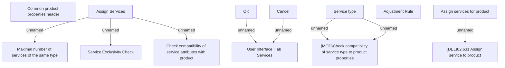

# Service or Insurance-Assign

```mermaid
graph TD
    MOD_Check_compatibility_of_service_type_to_product_propertie["{MOD}Check compatibility of service type to product properties"]
    Check_compatibility_of_service_attributes_with_product["Check compatibility of service attributes with product"]
    Service_Exclusivity_Check["Service Exclusivity Check"]
    Maximal_number_of_services_of_the_same_type["Maximal number of services of the same type"]
    Common_product_properties_header["Common product properties header"]
    Assign_Services["Assign Services"]
    DEL_02_631_Assign_service_to_product["{DEL}02.631 Assign service to product"]
    User_Interface_Tab_Services["User Interface :Tab Services"]
    OK["OK"]
    Cancel["Cancel"]
    Service_type["Service type"]
    Adjustment_Rule["Adjustment Rule"]
    Assign_services_for_product["Assign services for product"]
    OK -->|unnamed| User_Interface_Tab_Services
    Cancel -->|unnamed| User_Interface_Tab_Services
    Assign_services_for_product -->|unnamed| DEL_02_631_Assign_service_to_product
    Assign_Services -->|unnamed| Maximal_number_of_services_of_the_same_type
    Assign_Services -->|unnamed| Service_Exclusivity_Check
    Assign_Services -->|unnamed| Check_compatibility_of_service_attributes_with_product
    Service_type -->|unnamed| MOD_Check_compatibility_of_service_type_to_product_propertie
    Service_type -->|unnamed| MOD_Check_compatibility_of_service_type_to_product_propertie
```
