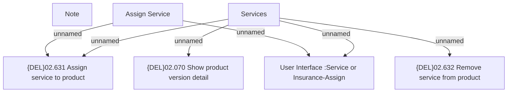

# Tab Services

```mermaid
graph TD
    el_1803019["Note"]
    User_Interface_Service_or_Insurance_Assign["User Interface :Service or Insurance-Assign"]
    DEL_02_632_Remove_service_from_product["{DEL}02.632 Remove service from product"]
    DEL_02_631_Assign_service_to_product["{DEL}02.631 Assign service to product"]
    DEL_02_070_Show_product_version_detail["{DEL}02.070 Show product version detail"]
    Assign_Service["Assign Service"]
    Services["Services"]
    Services["Services"]
    Services -->|unnamed| DEL_02_070_Show_product_version_detail
    Services -->|unnamed| DEL_02_631_Assign_service_to_product
    Assign_Service -->|unnamed| DEL_02_631_Assign_service_to_product
    Services -->|unnamed| DEL_02_632_Remove_service_from_product
    Services -->|unnamed| User_Interface_Service_or_Insurance_Assign
    Assign_Service -->|unnamed| User_Interface_Service_or_Insurance_Assign
```
