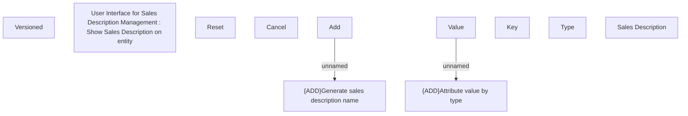

# Set Sales Description on entity

```mermaid
graph TD
    Versioned["Versioned"]
    ADD_Generate_sales_description_name["{ADD}Generate sales description name"]
    User_Interface_for_Sales_Description_Management_Show_Sales_D["User Interface for Sales Description Management : Show Sales Description on entity"]
    Reset["Reset"]
    Cancel["Cancel"]
    Add["Add"]
    ADD_Attribute_value_by_type["{ADD}Attribute value by type"]
    Value["Value"]
    Key["Key"]
    Type["Type"]
    Sales_Description["Sales Description"]
    Value -->|unnamed| ADD_Attribute_value_by_type
    Add -->|unnamed| ADD_Generate_sales_description_name
```
